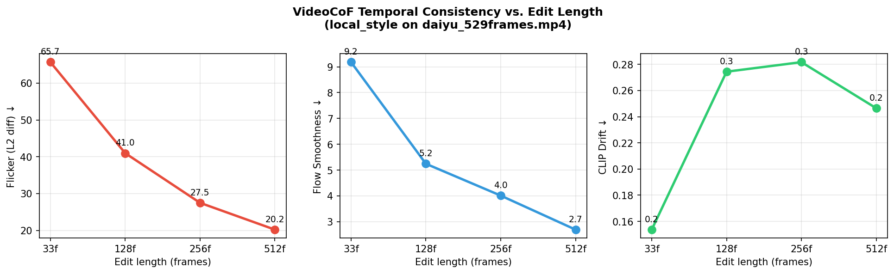
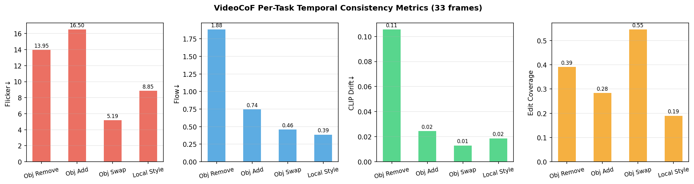

# CSIE7694 VFX Final Project

**VideoCoF: Unified Video Editing with Temporal Reasoner**  
Research track — CVPR 2026 Highlight

Based on: https://github.com/knightyxp/VideoCoF  
Paper: arXiv 2512.07469  
Our repo: https://github.com/goog-msft-fb-nflx-nvda-aapl/csie7694-vfx-final

---

## Project Summary

We reproduce VideoCoF's **"See → Reason → Edit"** video editing pipeline and extend it with a **Temporal Edit-Consistency Evaluator** — optical-flow-based flicker and identity-drift metrics applied across short (33-frame) and long (up to 512-frame) edits.

**Key finding:** VideoCoF's temporal reasoner produces *smoother* edits at longer sequences. Flicker decreases monotonically: **65.7 → 41.0 → 27.5 → 20.2** (33→128→256→512 frames).

---

## Demo Videos (side-by-side: source | edited)

### Official Asset Demos — 4 Task Types

| Task | Video |
|------|-------|
| **Object Removal** — remove person from two-man scene | [](https://youtu.be/YrSXDfodARQ) |
| **Object Addition** — add balloon to woman scene | [](https://youtu.be/DVdjT1-NwJY) |
| **Object Swap** — swap storefront sign | [](https://youtu.be/9XwIsaIqAeA) |
| **Local Style Transfer** — ketchup bottle style | [](https://youtu.be/JrKO-eHL4x4) |

### Custom Video Demos

| Task | Video |
|------|-------|
| **Object Removal** — remove walking person (custom video) | [](https://youtu.be/otCqmUiymGI) |
| **Object Addition** — add cat in greenhouse (custom video) | [](https://youtu.be/AaGL1IsZZVA) |
| **Local Style Transfer** — golden brown dough (custom video) | [](https://youtu.be/tz7ex2RaQ5I) |

### Long-Video Extrapolation (daiyu_529frames — Local Style Transfer)

| Length | Video |
|--------|-------|
| **128 frames** (4× baseline) | [](https://youtu.be/kBDuQB4zHmY) |
| **512 frames** (16× baseline) | [](https://youtu.be/eaK4FQZ6XSc) |

---

## Evaluation Results

### Per-Task Temporal Consistency (33-frame baseline)

| Task | Edit Coverage | Flicker ↓ | Flow Smoothness ↓ | CLIP Drift ↓ |
|------|:---:|:---:|:---:|:---:|
| Object Removal | 0.391 | 13.95 | 1.881 | 0.106 |
| Object Addition | 0.283 | 16.50 | 0.744 | 0.025 |
| Object Swap | 0.545 | 5.19 | 0.458 | 0.013 |
| Local Style | 0.190 | 8.85 | 0.386 | 0.019 |

> Object removal shows highest flicker/drift (hardest task); local style transfer is most consistent.

### Temporal Consistency vs. Edit Length (local_style, daiyu video)

| Length | Frames | Flicker ↓ | Flow Smoothness ↓ | CLIP Drift ↓ |
|--------|:------:|:---:|:---:|:---:|
| Baseline | 33 | 65.7 | 9.18 | 0.154 |
| 4× | 126 | 41.0 | 5.24 | 0.274 |
| 8× | 254 | 27.5 | 4.01 | 0.282 |
| 16× | 510 | **20.2** | **2.69** | 0.247 |

**Finding:** Flicker and flow smoothness improve monotonically with edit length, confirming that VideoCoF's temporal reasoning chain produces increasingly stable edits at longer sequences. CLIP drift increases slightly at longer range (style drifts) — an interesting trade-off.




---

## Research Extension: Temporal Edit-Consistency Evaluator

**`eval_consistency.py`** — metrics computed in the optical-flow-detected edit region:

- **Flicker** (L2 diff): mean pixel-level change between consecutive frames in the edited mask
- **Flow Smoothness** (Farneback): mean optical flow magnitude — lower = smoother motion
- **CLIP Drift**: cosine distance of CLIP embeddings vs. frame 0 — measures semantic drift

```bash
python eval_consistency.py --edited <edited.mp4> --source <source.mp4> --tag <label> --out eval_results.jsonl
python plot_eval.py --results eval_results.jsonl
```

---

## Setup

See [WORKLOG.md](WORKLOG.md) for full environment and experiment log.

**GPU server:** gsm-gpu — 8× H200 (143 GB each), CUDA 12.4  
**Conda env:** `videocof` (miniforge3, Python 3.10, PyTorch 2.5.1+cu121)

```bash
# Inference (4-step DMD, ~20 s/video on 1× H200)
conda activate videocof
cd /home/jtan/vfx/VideoCoF
CUDA_VISIBLE_DEVICES=0 torchrun --nproc_per_node=1 --master_port=29500 \
    predict_fast_infer.py --task_type obj_rem \
    --video_path assets/two_man.mp4 \
    --edit_prompt "Remove the man in grey jacket"
```

---

## Tasks Demonstrated

| # | Task Type | Description |
|---|-----------|-------------|
| 1 | Object Removal | Remove a person or object from the scene |
| 2 | Object Addition | Add a new object that wasn't in the original |
| 3 | Object Swap | Replace one object with another |
| 4 | Local Style Transfer | Change color/texture/style of a region |
| 5 | Long-video Extrapolation | Extend editing to 128/256/512 frames (16× baseline) |
